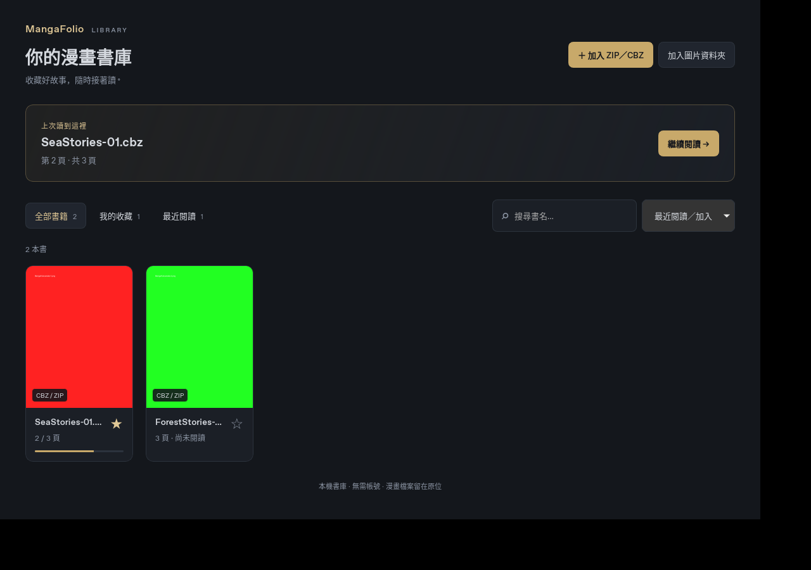

# 書庫新功能教學

適用分支：`feature/library-favorites-resume`。這些功能目前在開發分支，GitHub Releases 的既有安裝包尚未包含此版。

## 取得與啟動

已安裝 Node.js 22、Rust 與 Tauri 系統依賴後，在本地專案目錄執行：

```bash
git fetch origin
git switch feature/library-favorites-resume
git pull --ff-only origin feature/library-favorites-resume
npm ci
npm run tauri dev
```

如果本地尚未建立此分支，可用 `git switch --track origin/feature/library-favorites-resume` 取代上面的 `git switch`。若有尚未提交的修改，先保存，再切換分支。

## 對照實際畫面

以下是此分支的書庫實測截圖，紅綠封面為測試圖片；加入你的漫畫後會顯示真正的封面。新加入的「新功能教學」面板位於首頁標題下方，未顯示在這張較早的截圖中。



| 步驟 | 在哪裡操作 | 如何確認新功能 |
| --- | --- | --- |
| 1. 加入漫畫 | 右上「＋ 加入 ZIP／CBZ」或「加入圖片資料夾」 | ZIP／CBZ 可多選；資料夾須直接包含圖片。加入後下方顯示封面卡片，原始檔案留在原位。 |
| 2. 開始閱讀 | 點封面，在閱讀工具列或方向鍵翻頁，再點左上「書庫」 | 卡片顯示目前頁碼與進度條；新增但沒讀過的書顯示「尚未閱讀」。 |
| 3. 收藏作品 | 點卡片的 ☆，再點「我的收藏」 | ☆ 變成 ★，收藏數量更新；再次點擊可取消。閱讀工具列也能收藏。 |
| 4. 搜尋與排序 | 右側「搜尋書名…」及排序選單 | 輸入部分書名即可篩選，支援大小寫及全形／半形。可搭配「我的收藏」「最近閱讀」；清除文字恢復列表。 |
| 5. 自動續讀 | 開書翻頁後返回首頁，點「繼續閱讀」 | 顯示並開啟上次位置。「最近閱讀」只列出讀過的書。正常關閉重啟後再次確認收藏與頁碼。 |

## 程式內的教學引導

- 第一次進入書庫會展開五步教學，金色框線標示相關操作區域。
- 可以點「上一步」「下一步」，也能直接點任一步驟，一邊照做一邊對照。
- 不需要先完成教學才能使用書庫；「收合教學」和「完成教學」會記住收合狀態。
- 想重看時，點「開始教學 →」。返回書庫時會保留上次教學步驟。

## 常見情況

- 沒有「繼續閱讀」：先實際開一本書閱讀，返回書庫，切到「全部書籍」並清空搜尋。剛加入但尚未閱讀的書不會列入最近閱讀。
- 搜尋不到：這版只搜尋已加入書庫的**書名**，不搜尋漫畫內文、作者或標籤。
- 顯示「來源離線」：程式找不到原路徑；收藏與進度仍保留。將來源接回原路徑後重新載入書庫。
- 進度儲存失敗：依畫面提示「重試儲存」，成功後再關閉；不必用強制結束方式關閉。
- 資料目前只保存在這台電腦，沒有雲端同步。這版也尚未包含遞迴掃描、搬移後重新定位及頁面書籤。
