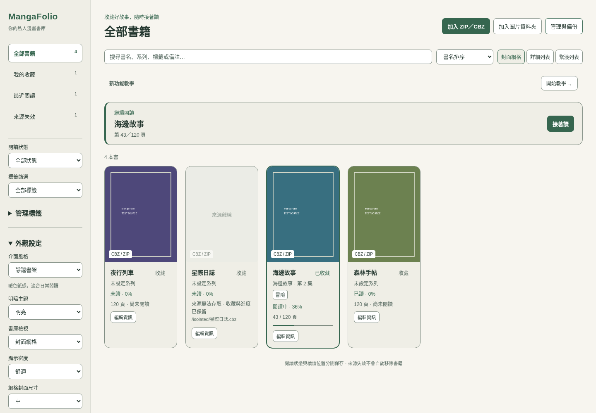

# 書庫與管理功能教學

適用分支：`feature/library-management-ui`。這是待獨立審查及實機驗收的開發版，GitHub Releases 的既有安裝包尚未包含本次功能。

## 取得與啟動

先保留本地未提交修改，安裝 Node.js 22、Rust 及 Tauri 平台依賴後執行：

```bash
git fetch origin
git switch feature/library-management-ui
git pull --ff-only origin feature/library-management-ui
npm ci
npm run tauri dev
```

尚無本地分支可使用 `git switch --track origin/feature/library-management-ui`。單獨 `npm run dev` 不包含原生 IPC，不能讀實際書庫。

## 日常閱讀與三種介面



- 加入 ZIP／CBZ 可多選；圖片資料夾須直接包含圖片，不掃描子目錄。來源檔案留在原位。
- 點封面開書；閱讀工具列及方向鍵翻頁，點「書庫」保存進度後返回。來源失效時無法開啟，但收藏與進度仍保留。
- 收藏按鈕以文字顯示「收藏／已收藏」，閱讀器也可切換；操作成功後同步同一本閱讀器狀態。
- 在「外觀設定」自由選擇靜謐書架、目錄工作台、夜讀書房。每種都支援封面網格、詳細列表、緊湊列表，以及明亮／深色／跟隨系統、舒適／緊湊密度、小／中／大網格封面。
- 外觀會在這台電腦記住。切換不重設搜尋、篩選、排序或有效選取；保存失敗有提示，本次仍可操作。
- 窄視窗點「書庫導覽與設定」展開次要項目；「新功能教學」可自願開啟、跳步、收合及重看，不強制打斷閱讀。

## 搜尋、閱讀狀態與標籤

搜尋書名、原始來源名稱、系列、集數、標籤及備註，支援大小寫、全形／半形；不搜尋來源路徑，所以 `.cbz` 不會造成書名搜尋誤命中。可組合收藏、最近閱讀、來源失效、閱讀狀態及一個標籤篩選。書名及系列／集數採自然排序。

未保存閱讀時間是未讀；保存進度但目前視圖未包含最後頁是閱讀中；單頁最後頁或雙頁最後一組即為已讀。重新加入／重新指定來源後，自動狀態依新頁數與有效續讀位置更新。管理模式可手動標記已讀／未讀，**不清除續讀位置**；後續閱讀不覆寫手動狀態，選「依進度判定」恢復自動。狀態與進度百分比都會顯示，所以手動已讀但 0% 是允許的情況。

### 更新舊版的自動閱讀狀態

既有 v2 書庫可能保留修正前的自動狀態，例如雙頁最後一組仍顯示閱讀中，或來源增頁後仍顯示已讀。啟動程式不會全面回填；還原 v2 備份也會保留備份保存值。

對需要更新的書籍，可在管理模式選取後點「依進度判定」。重新開書、保存閱讀進度、重新加入或重新指定來源也會依目前頁數、續讀位置與單／雙頁設定更新自動狀態；等待操作和進度保存完成，再返回或重新載入書庫，查看已讀篩選與續讀項目。

上述自動操作會保留手動已讀／未讀。只有你明確選「依進度判定」才解除手動標記並重新推導；更新狀態不清除續讀位置。來源仍無法存取時，可先依保存進度判定，或恢復來源後再重新開書。

「管理標籤」可建立、重新命名及刪除；trim 後 1–64 字，不含控制字元，同名不區分大小寫。每本最多 100 個、全庫最多 1000 個標籤。刪除標籤只移除標籤及關聯，保留書籍和來源。

## 資訊編輯與批次管理

點「編輯資訊」設定自訂書名、系列、集數及備註；原始來源名稱與路徑另行顯示。自訂書名留白則使用來源名稱；不更名來源，重新加入或開書不覆寫自訂資訊。

「管理與備份」會顯示選取數量。可選取目前顯示的書、清除選取、批次收藏、標記狀態、加入／移除標籤及移出書庫。搜尋與篩選後選取保留，可能包含其他篩選中的書，操作前核對數量。移除僅刪書庫記錄及自有封面快取，來源檔案保留；收藏、進度及資訊會移除，可先備份。

## 批次匯入與失效來源

匯入顯示完成數、目前來源與逐筆新增／更新／失敗／來源衝突／取消結果；一筆失敗不阻止其他來源。取消停止尚未開始者，正在執行者仍完成並保留；完成後可重試失敗、衝突及未開始項目。匯入期間不能重複啟動、開書或進行衝突管理操作。

「來源失效」集中顯示目前無法存取的來源、路徑及說明。暫時離線不自動移除。進入管理、只選一本，再用「重新指定 ZIP／CBZ」或「重新指定圖片資料夾」選同一本漫畫，保留 ID、收藏、進度、偏好、標籤與自訂資訊。來源已屬其他書時拒絕，不自動合併；成功後重新開書。

## 備份與還原

管理面板展開「備份與還原」。備份 v2 包含來源路徑、收藏、進度、閱讀偏好、閱讀狀態、標籤及關聯、自訂書名、系列、集數、備註；不含漫畫、封面、教學或外觀偏好。漫畫檔案請另外備份。

匯出須使用新檔名，不覆寫來源或既有備份。還原合併，既有來源略過且保留目前資料；無效資料、重複來源、較新不支援版本整批拒絕，交易失敗不部分還原。支援舊 v1 備份，新欄位採合理預設。仍有 16 MiB／10000 本限制。

資料庫升級至 schema v2；舊程式不能直接使用升級後庫。升級前請保存備份；回退時不要刪除資料庫繞過版本檢查。

## 驗證與交辦

圖為實際 Vue 畫面與隔離 in-memory IPC，不是原生 Windows 驗收。Linux 原生證據、測試輸出及未執行項目見 [本輪驗證](next-phase-validation.md)；獨立審查與 Windows 逐步清單見 [審查交辦](next-phase-review-assignment.md)。未發布安裝包。


## 本次介面精修與閱讀工具列

[完整實際画面預覽](ui-refinement-preview.md)包含三種風格與閱讀器。開書後上下工具列預設隱藏，滑鼠移到上、下邊緣會顯示；Esc 可切換，Tab 聚焦控制項時也會顯示，觸控裝置可點「工具列」。上方的「書庫」返回書库。工具列顯示不會擠縮圖片，既有縮放設定及比例保留；儲存失敗及重試入口仍可見。
