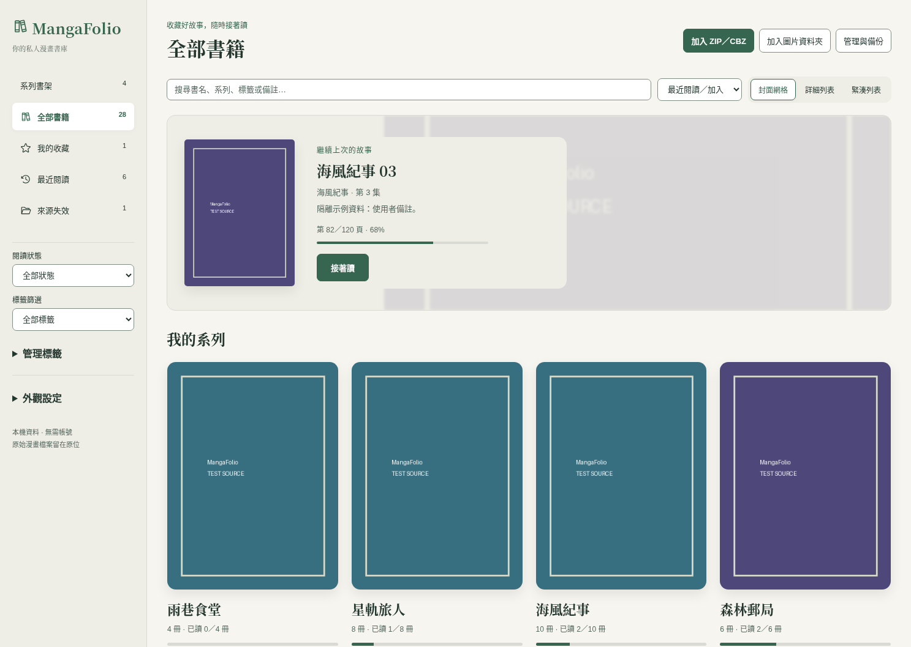
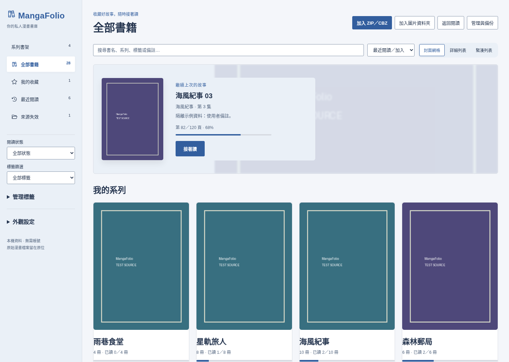
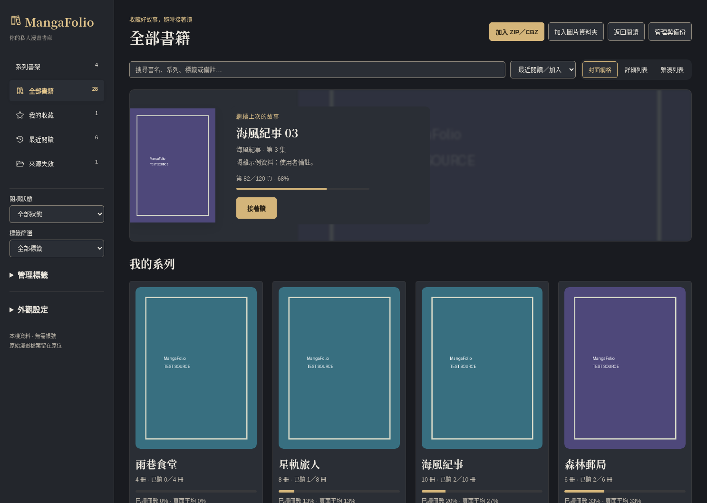

# 第三階段完整實際介面與參考對照

日期：2026-10-04 Asia/Tokyo，對應產品 `ad0e366cb0d7c4b583968243f8d864d58fce0d3e`。以下 PNG 都由實際執行程式擷取，沒有生成圖冒充成品。browser 畫面是實際 Vue＋隔離 mock IPC，原生畫面另列；Windows 尚未驗收。

## 正確參考與素材

已直接檢視使用者三張正確內嵌圖：01_56_49 暖白茶綠首頁、01_56_58 冷白藍系列詳情＋書籍側欄、01_57_03 炭灰金色首頁。上一階段三圖不是本次參考。

原始 PNG 在對話可見，但 Windows Downloads 路徑不在此雲端，沒有可下載 file ID。正式 [references 歸檔](images/third-phase/references/README.md) 待原檔取得；不把重製圖或舊圖放在指定原圖檔名，不宣稱那些 PNG 已存在。

三風格 screenshot 使用同一 28 本／4 系列／1 離線來源 fixture，browser 1487×1058，與參考尺寸相同。隔離測試封面為明確標示 TEST SOURCE 的來源圖片；原生同樣從臨時 PNG 真正解碼。產品封面取自使用者書籍／既有快取，不自動下載未知圖片。無封面為文字占位，續讀背景只裁切／模糊同一本封面，沒有虛構故事簡介。

## 首頁

### 靜謐書架

### 目錄工作台

### 夜讀書房

## 配套畫面圖庫

每組由相同元件與資料操作驅動，風格、主題、檢視獨立設定。點連結檢視完整大小。

| 畫面 | 靜謐書架 | 目錄工作台 | 夜讀書房 |
| --- | --- | --- | --- |
| 系列詳情（詳細列表） | [查看](images/third-phase/implemented/calm-series.png) | [查看](images/third-phase/implemented/catalog-series.png) | [查看](images/third-phase/implemented/night-series.png) |
| 書籍詳情／書籤入口 | [查看](images/third-phase/implemented/calm-book-details.png) | [查看](images/third-phase/implemented/catalog-book-details.png) | [查看](images/third-phase/implemented/night-book-details.png) |
| 閱讀器工具列隱藏 | [查看](images/third-phase/implemented/calm-reader-hidden.png) | [查看](images/third-phase/implemented/catalog-reader-hidden.png) | [查看](images/third-phase/implemented/night-reader-hidden.png) |
| 閱讀器工具列顯示 | [查看](images/third-phase/implemented/calm-reader-shown.png) | [查看](images/third-phase/implemented/catalog-reader-shown.png) | [查看](images/third-phase/implemented/night-reader-shown.png) |
| 安全備份與還原預覽 | [查看](images/third-phase/implemented/calm-backup-preview.png) | [查看](images/third-phase/implemented/catalog-backup-preview.png) | [查看](images/third-phase/implemented/night-backup-preview.png) |
| 較新備份拒絕 | [查看](images/third-phase/implemented/calm-backup-rejected.png) | [查看](images/third-phase/implemented/catalog-backup-rejected.png) | [查看](images/third-phase/implemented/night-backup-rejected.png) |
| 搜尋無結果 | [查看](images/third-phase/implemented/calm-no-results.png) | [查看](images/third-phase/implemented/catalog-no-results.png) | [查看](images/third-phase/implemented/night-no-results.png) |
| 640×480導覽 | [查看](images/third-phase/implemented/calm-narrow-home.png) | [查看](images/third-phase/implemented/catalog-narrow-home.png) | [查看](images/third-phase/implemented/night-narrow-home.png) |
| 640×480書籍詳情 | [查看](images/third-phase/implemented/calm-narrow-details.png) | [查看](images/third-phase/implemented/catalog-narrow-details.png) | [查看](images/third-phase/implemented/night-narrow-details.png) |

[閱讀器書籤新增／筆記](images/third-phase/implemented/reader-bookmarks.png)、[固定工具列](images/third-phase/implemented/reader-pinned.png)、[窄窗單本詳情](images/third-phase/implemented/narrow-book-details.png)。原生 Linux 有 [最新產品重啟](images/third-phase/native/current-product-boot.png)、[本機安全備份成功](images/third-phase/native/safety-backup-created.png)、[首頁](images/third-phase/native/home-calm.png)、[系列＋單本側欄](images/third-phase/native/catalog-book-details.png)、[滿高閱讀](images/third-phase/native/reader-hidden.png)、[hover覆蓋工具列](images/third-phase/native/reader-top-hover.png)、[書籤與純文字筆記](images/third-phase/native/reader-bookmarks.png)、[最後頁下一集](images/third-phase/native/reader-next-volume.png)、[實際開啟第4集](images/third-phase/native/reader-next-opened.png)。原生截图是操作過程，閱讀數據會隨實際保存變化，不用來聲稱跨風格固定狀態對照。

## 逐項比較與合理差異

| 比較項目 | 參考 | 本次實作／理由 |
| --- | --- | --- |
| 版面 | 左側導覽、上方搜尋加入、續讀主區、系列入口 | 保留同一結構；加入 ZIP／CBZ 與資料夾分為明确兩入口，既有狀態／標籤篩選常駐側欄 |
| 封面 | 示意漫畫、3D 書脊、裝飾書堆 | 取真實來源，系列代表第一個可存取的集數；不假造書脊或植物素材；隔離圖片只是測試來源 |
| 續讀 | 大背景、封面、進度、閱讀按鈕與故事簡介 | 同本封面裁切／模糊、閱讀按鈕在文字區，文字背板確保對比；僅使用者備註，無資料時不冒充簡介 |
| 字級 | 靜謐／夜讀較有書房感，工作台清晰 | 沿用既有 serif／sans 風格 token、主要書名與系列標題分層；中文实际系統字型可能與概念圖不同 |
| 留白 | 首頁大區塊、四個系列；工作台多欄列表 | 大型續讀及四系列入口；共用詳細／緊湊列表；整理系列收合，日常閱讀不堆批次操作 |
| 操作位置 | 系列详情右側封面與單本資訊 | 寬窗右側面板，窄窗全高可捲 dialog；主操作在三風格一致，管理模式另外顯示選取數量 |
| 進度 | 「已讀」和頁面百分比看似同一概念 | 明確顯示已讀冊數比例及頁面平均；手動已讀不改續讀索引，示例海風為2/10，頁面平均27% |
| 主題 | 三圖各自固定明暗 | 三風格與明暗獨立；使用者仍能每風格選明亮／深色／跟隨系統，不是三套不同產品 |
| 閱讀器 | 夜讀圖提示移到上下緣 | 默认上下工具列隱藏、hover／焦點／Esc／觸控入口，固定偏好可保存；圖片不被工具列擠動，錯誤另置可見 |

已直接檢視三風格首頁、系列／單本側欄、備份預覽、窄窗與原生閱讀／書籤；browser 回歸涵蓋長內容、中文 IME event、可見焦點／對比 token，但截图不能證明所有可及性與原生 IME／觸控行為。

## 驗收界線

這是開發者視覺／互動自檢，未宣稱獨立 Code Review、完整 Windows 原生或 WCAG 合規。原生 build 為 Linux debug＋當前 Vite frontend；GTK／PRoot 選檔限制仍在。原始 PNG 歸檔、Windows 完整流程、高 DPI、螢幕閱讀器及實體觸控待 [交辦](third-phase-review-assignment.md)。完整測試、退出碼、嘗試輸出見 [驗證](third-phase-validation.md)。
