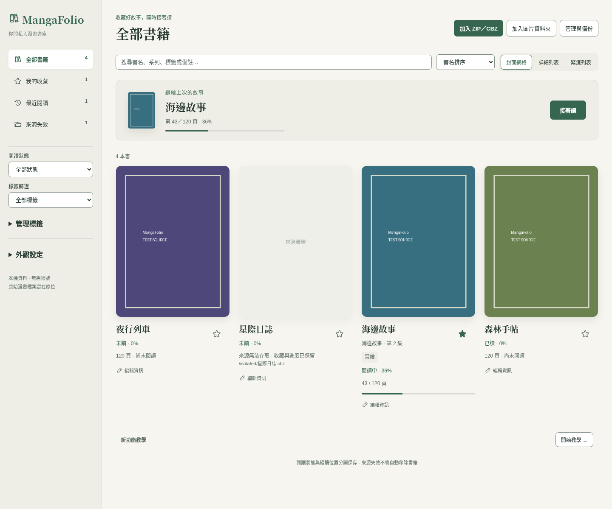
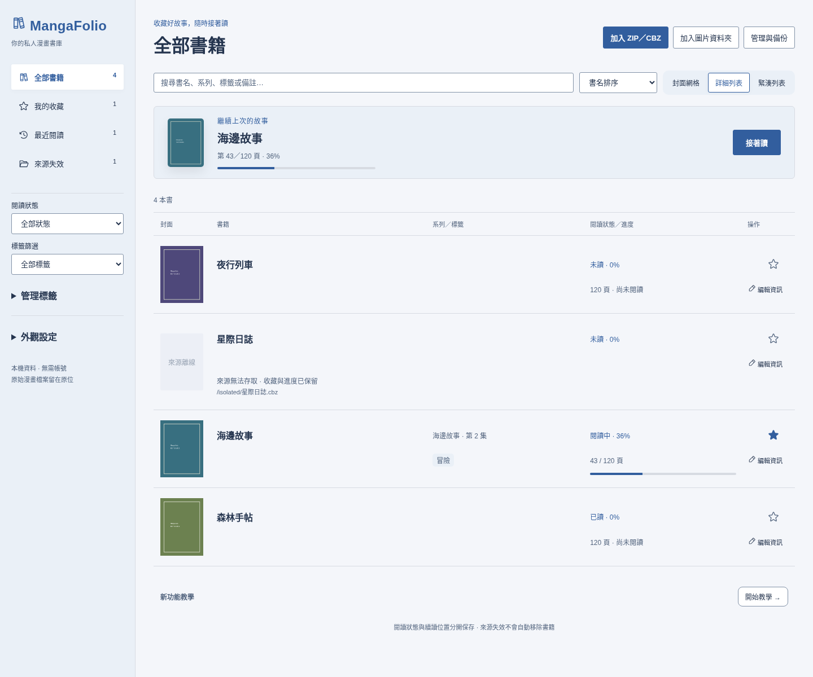
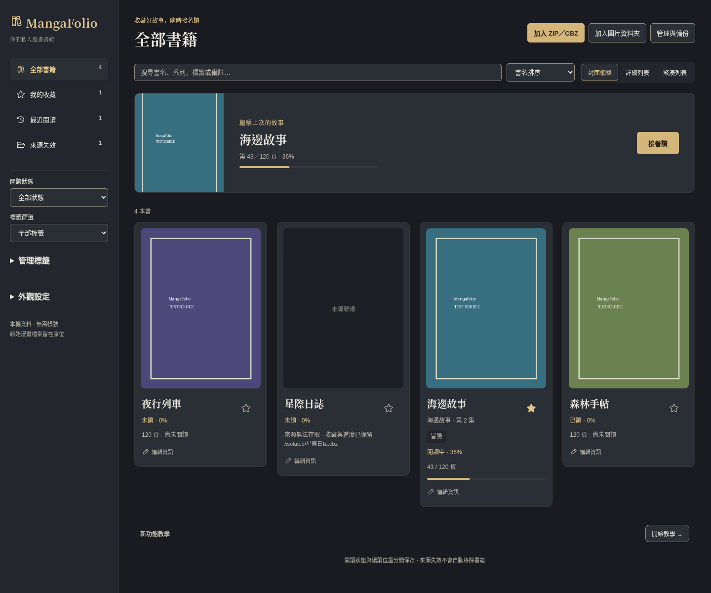
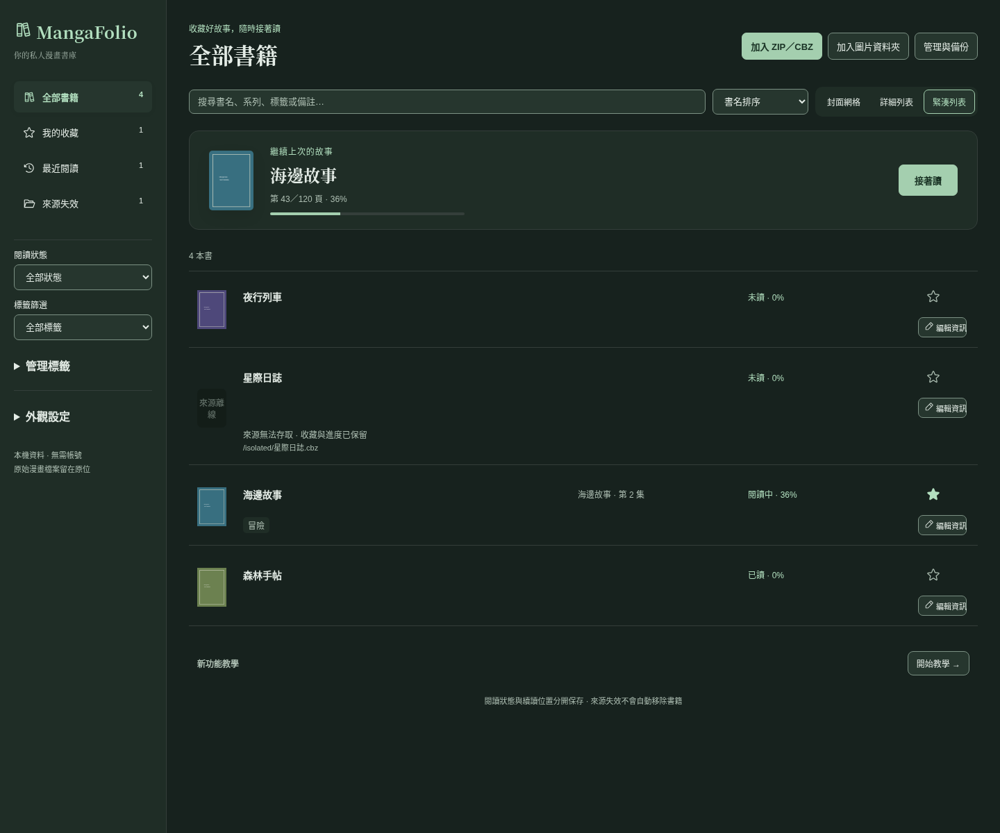
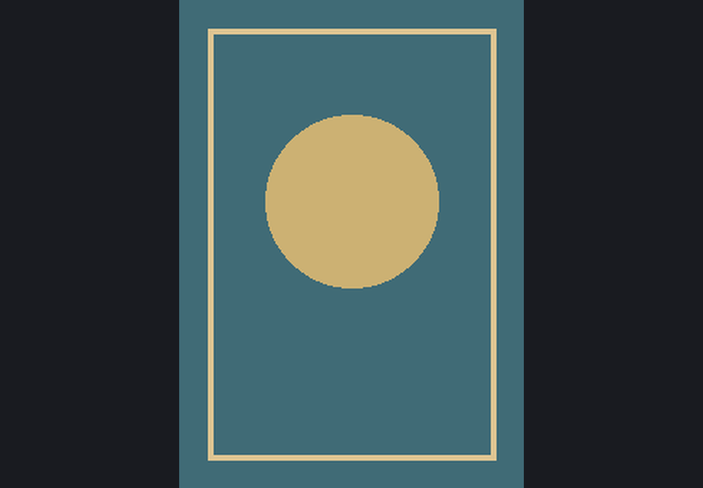
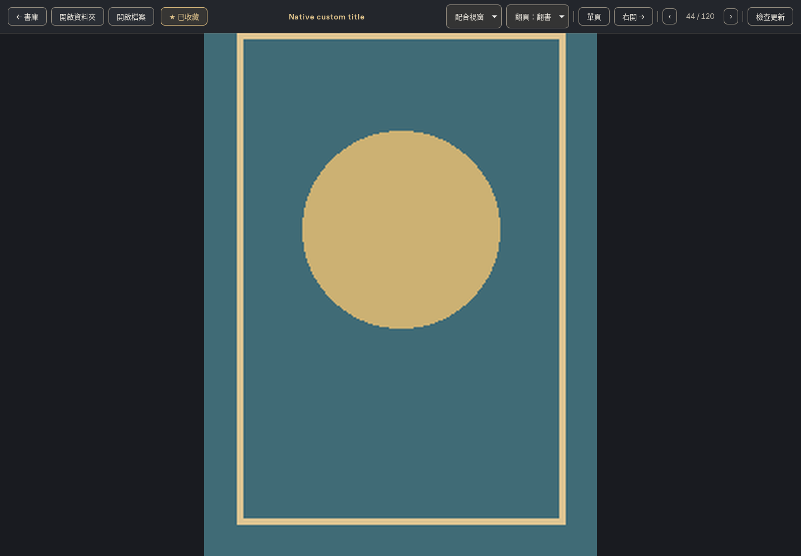
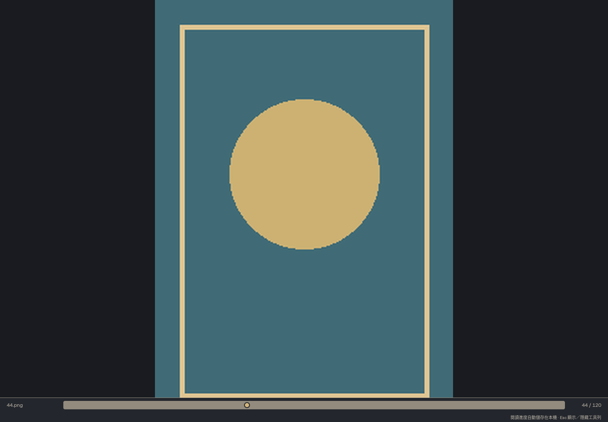

# 書庫視覺精修與沉浸閱讀預覽

2026-10-04（Asia/Tokyo）。基準 `54fc37596d5d34bfed72760bb8770969ab9f7774`；本次修改於 `feature/library-management-ui` 完成；實際產品提交以 Git 紀錄為準。使用者檢視畫面後已授權合併主線，保留獨立 merge commit。

## 畫面性質

以下是修改後實際 Vue 介面在 Chromium 執行的完整截圖，並非另一份未實作的視覺稿。使用隔離的記憶體 IPC、相同四本示例書籍與測試封面，不操作使用者資料庫。色塊封面不是產品預設素材；成品顯示使用者漫畫來源的實際封面。截圖視窗為 1440 × 1200，實際視窗較矮時書庫內容可捲動。字體、系統選單及檔案選擇器仍可能依作業系統不同。

## 靜謐書架：明亮、封面網格

暖色背景、較大的封面、輕量卡片與書名字體層次。續讀區顯示真實來源封面及進度。

## 目錄工作台：明亮、詳細列表

新增清楚的列表欄位標題；書名、系列／標籤、閱讀狀態／進度與操作對齊。離線來源仍顯示路徑與資料保留說明。

## 夜讀書房：深色、封面網格

暗色表面、暖金重點與更突出的續讀封面區。

## 其他組合與設定

三種風格仍可各自選擇網格、詳細列表、緊湊列表以及明亮／深色／跟隨系統；搜尋、篩選、排序和有效管理選取共用同一套狀態。

[目錄工作台深色網格](images/next-phase/refinement-after/catalog-dark-grid.png) · [夜讀書房明亮列表](images/next-phase/refinement-after/night-light-detail.png)

## 開書後：上下工具列預設隱藏

閱讀畫布使用完整可用視窗高度，保留既有縮放偏好及圖片比例，沒有拉伸或裁掉頁面。滑鼠移到上、下 24px 邊緣才顯示對應工具列；移開後隱藏。工具列覆蓋在圖片上，不重新擠縮閱讀畫布。

Esc 可顯示／隱藏兩列；Tab 聚焦到工具列控制項時保持可見。觸控裝置有「工具列」入口。輸入法組字、輸入欄位及開啟的對話框不觸發 Esc 切換。閱讀錯誤與進度儲存失敗、重試按鈕保持可見。

以下 Linux Tauri 原生畫面來自本次編譯程式與 `/tmp/mangafolio-next-phase-native` 隔離來源／資料庫。幾何圖形是測試頁面。

## 修改與擴充方式

- `src/themes.css`：語意色彩、裝飾分隔線、陰影、書名字體、封面尺寸與各風格卡片／續讀布局參數集中管理；可操作控制項仍使用可辨識的邊界色。
- `BookCard.vue`、`LibraryView.vue`：封面比例、列表排列、標準 Phosphor 圖示、較輕的邊框及留白，管理選取外觀只在管理模式顯示。
- `ContinueReading.vue`：來源封面、書名與進度；沿用既有封面佇列、取消與物件 URL 釋放。
- `ImmersiveReader.vue`、`App.vue`：覆蓋式工具列、hover／焦點／鍵盤／觸控入口與持續可見的錯誤提示。
- `LibraryGuide.vue`：教學入口移到內容尾端；更新閱讀器操作說明。
- `scripts/validate-next-phase.py`：輸出目錄可指定，保留歷史證據；完整新畫面截圖。
- `scripts/validate-immersive-reader.py`：隔離的閱讀器行為回歸測試。

不修改資料庫 schema、備份格式、來源比對、ID、收藏同步或閱讀進度判定。既有 A／R1／R2、N1／N2 審查報告維持原樣；歷史通過結果不代表本次變更已獨立複審。

## 本次驗證

完整輸出與退出碼位於 [visual-refinement](next-phase-results/visual-refinement/commands.json)。

- `npm test`：16 項通過。
- `npm run build`：通過。
- `cargo test --locked --manifest-path src-tauri/Cargo.toml`：Linux 37 項通過。
- `git diff --check`：通過。
- Linux 原生建置：通過，隔離啟動及閱讀全高／上下 hover 有畫面證據。
- [書庫瀏覽器驗證](next-phase-results/visual-refinement/after/results.json)：18 種組合、36 項色彩對比、管理、資訊編輯、標籤、匯入、來源失效、10,000 本資料、窄視窗及中文組字通過。
- [閱讀器瀏覽器驗證](next-phase-results/visual-refinement/immersive-reader.json)：預設隱藏、上下 hover、畫布尺寸不變、Esc／鍵盤焦點、錯誤與重試、窄視窗及觸控入口通過。

Windows 原生、實體觸控與 Windows 中文輸入法尚未執行本次驗收。瀏覽器 mock 測試不等於原生流程驗收。後續需複驗返回書庫、收藏同步、續讀及雙頁翻書，確認工具列顯示不影響原生圖片尺寸與進度保存。
